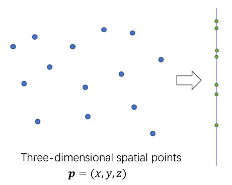
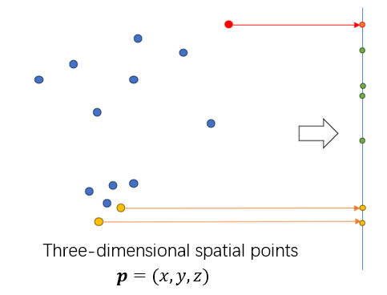
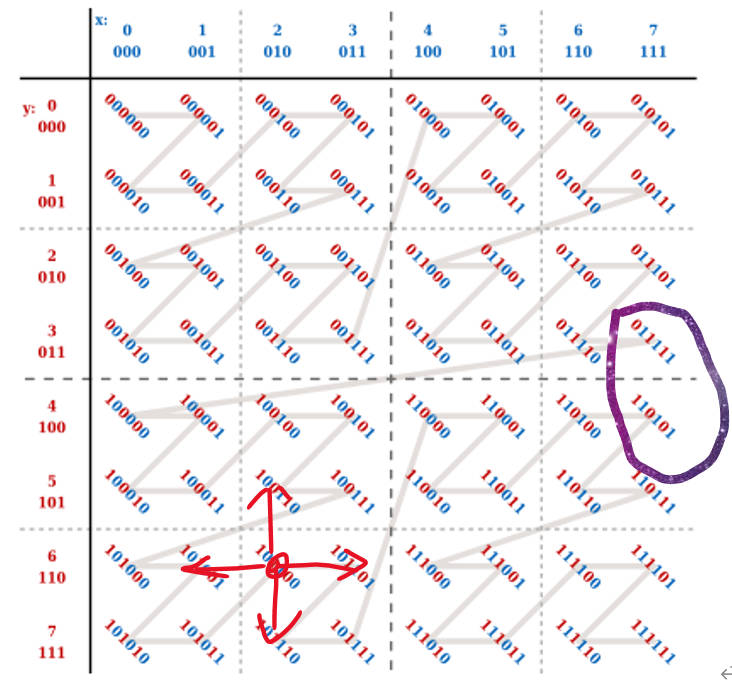
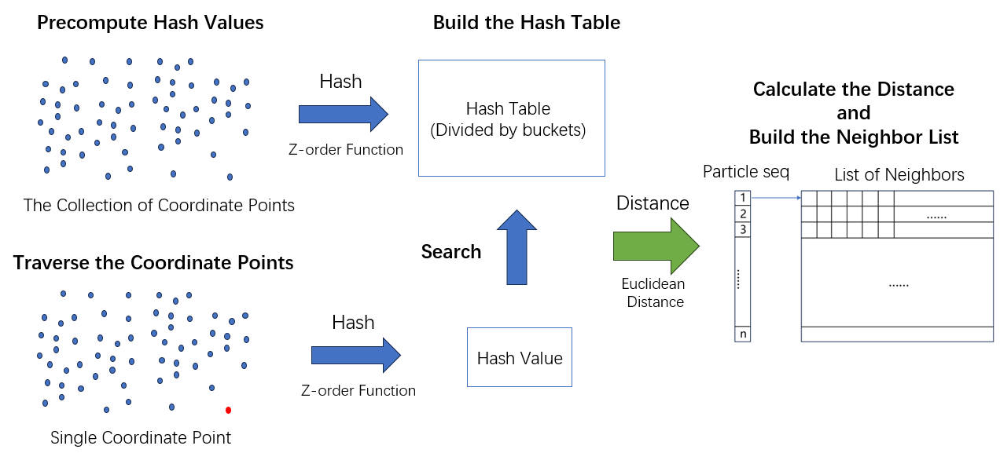

# Hash Neighbor List

## Introdution
Hash Neighbor List (HNL) is a library for efficient establishment of three-dimensional neighbor data. It leverages hash functions and data partitioning to accelerate neighbor search. This document will start with its fundamental theories, beginning with an introduction to its basic idea to the exact implementation, and then providing detailed instructions on installation, configuration, and usage. 

## Theory 

### 1. Basic Idea
By understanding Grid-based Neighbor List and Octree Neighbor List, we can observe that they fundamentally involve spatial partitioning or tree structure construction to allocate three-dimensional data into corresponding buckets. Subsequently, this correspondence is exploited to accelerate the search for neighboring data. HNL follows a similar concept, with a slight difference in that it aims to achieve bucket allocation directly through certain hash functions. And it places specific demands on these hash functions:
1. Dimension Transformation: Transforming three-dimensional data into a more manageable one-dimensional format (Figure 1).
2. Computational Efficiency.
3. Maintaining Neighborhood Relationships: Meaning that the resulting one-dimensional data should maintain the same neighborhood relationships as in three-dimensional space (Figure 2).


<figure>
  
  <figcaption>Figure 1: Hash function shoud transform the dimension </figcaption>
</figure>


<figure>
  
  <figcaption>Figure 2: Hash function should preserves neighborhood relationships. In three-dimensional space, two yellow particles are closer to each other, so their mappings to one-dimensional data are numerically closer. However, the yellow data is far apart from the red data in three-dimensional space, so their corresponding one-dimensional data is numerically more dispersed</figcaption>
</figure>


### 2. The Z-oder Function
For such hash functions, one possible solution is the space-filling algorithm, for example the Z-order function, also known as the Morton code. In a two-dimensional or multi-dimensional coordinate space, the Z-order function interleaves the bits of each coordinate point's various dimensions (binary bits) into an integer to generate its Z-order value.

Taking the example of two dimensions (Figure 3), let's assume we have the coordinates of a point as (x, y), where x and y are integers. The Z-order numerical value for this point can be calculated as follows:

1. Extend the binary representations of x and y to the same number of bits so that they have the same length (fill with leading zeros if necessary).
2. Alternately insert the bits of x and y into a new integer, starting from the most significant bit of x, followed by the most significant bit of y, then the next most significant bit of x, and so on.
3. The resulting combined integer is the Z-order value.

<figure>
  
  <figcaption>Figure 3: An example of the Z-order function in two dimensional space.</figcaption>
</figure>

With such filling method, the Z-order function can transform original high-dimensional coordinate points into one-dimensional data representing their position on the Z-order curve.

However, this method is not designed for the Neighbor list. We can observe the following problems:
1. Not Suitable for Floating-Point Numbers: The Z-order function is based on integer coordinates and is not directly applicable to floating-point coordinate values.
2. Imperfect Mapping of Z-order Function: Coordinate points with close hash values are guaranteed to be neighbors in three-dimensional space. However, in three-dimensional space, neighboring coordinate points may not necessarily have similar hash values (as shown in the red box in Figure 3).

To address the above issues, we make the following improvements:
1. For floating-point numbers, we can avoid this by rounding to integers, and approximate rounding can also improve efficiency to some extent.
2. One possible solution to the imperfect mapping is to establish a boundary range during the mapping process (as indicated by the red points and four arrows in Figure 3). For a given point, in addition to calculating its corresponding Z-order function value, we can also calculate the values for the four neighboring points and create a set based on this information to establish neighborhood relationships. However, this method may increase computational complexity, and further verification will be conducted in the future.


### 3. Algorithm Flow
The specific algorithm workflow is as follows (Figure 4):

1. Precompute Hash Values and Build a Hash Table:
For each three-dimensional coordinate point, use the Z-order function to map it to one-dimensional data and build a hash table based on this mapping. The keys in the hash table are the hash values, and the values are the corresponding indices of three-dimensional coordinate points. Insert all coordinate points into the hash table based on their hash values to create an index.

2. Traverse Three-Dimensional Coordinate Points and Search for Neighbors:
Iterate through the three-dimensional coordinate points again, calculate their hash values, and search for coordinate points in the hash table with similar hash values to identify potential neighbor candidates.

3. Precise Coordinate Distance Calculation and Neighbor Table Construction:
In this step, perform accurate coordinate distance calculations on the retrieved neighbor candidates from the hash table. Filter out particles that satisfy the cut-off radius to construct the Neighbor List.


<figure>
  
  <figcaption>Figure 4: The algorithm flow</figcaption>
</figure>

## Installation
(In designing)

## Configuration Method
The HB_NBL_cube class in HNL primarily involves three parameters: cube_size, num_particles, cut_off_radius, and three hyperparameters: coefficient, range_size, move_size. 

```Python
class HB_NBL_cube:
    def __init__(self, cube_size, num_particles, cut_off_radius, coefficient=1, range_size=350, move_size=1):
        """
        Initialize the hash-based neighbor list cube object.

        Parameters:
            - cube_size (list or numpy.ndarray): The size of the cube, containing three values, used to define the dimensions of the simulated three-dimensional space.

            - num_particles (int): The number of particles, defining the total number of particles in the system.

            - cut_off_radius (float): The cutoff radius, used to determine the neighbor relationships between particles. Particles with a distance less than or equal to the cutoff radius are considered neighbors.

            - coefficient (int, optional): A scaling factor for floating-point numbers, used to enable the Z-order function to work with floating-point numbers. The default is 1, but for smaller systems, it may need to be appropriately adjusted.

            - range_size (int, optional): An integer representing the bucket size for constructing the hash function. In geometric space, it corresponds to an adaptive region related to particle density. Smaller buckets result in fewer particles to iterate over, increasing efficiency, and vice versa. The default is 350.

            - move_size (int, optional): An integer representing the boundary range for particle mapping. A larger boundary range increases precision but also introduces more computational load, and vice versa. The default is 1.
        """
        self.cube_size = np.array(cube_size)  # Size of the cube
        self.rc = cut_off_radius  # Cutoff radius
        self.num_particles = num_particles
        # Represents the neighbor relationships of particles
        self.particle_list = [[] for _ in range(num_particles)]
        # Hash table: hashed_value: particle_seq, constructed using defaultdict
        self.hash_table = defaultdict(list)
        self.hash_list = [[] for _ in range(num_particles)]
        self.coefficient = coefficient
        self.range_size = range_size
        self.move_size = move_size
```


## Usage Method
```Python
from hash_based_nbl import HB_NBL_cube

cube_size = (10, 10, 10)
num_particles = 50000
cut_off_radius = 1.0

lc_cube = HB_NBL_cube(cube_size, num_particles, cut_off_radius)

# Generate test data
np.random.seed(1)
inputs = np.random.random((num_particles, 3)) * cube_size

# Call the constructor method for initialization
lc_cube.constructor(inputs)

# Get neighbors for a specific particle
particle_seq = 15
neighbors = lc_cube.get_neighbors(particle_seq)

```